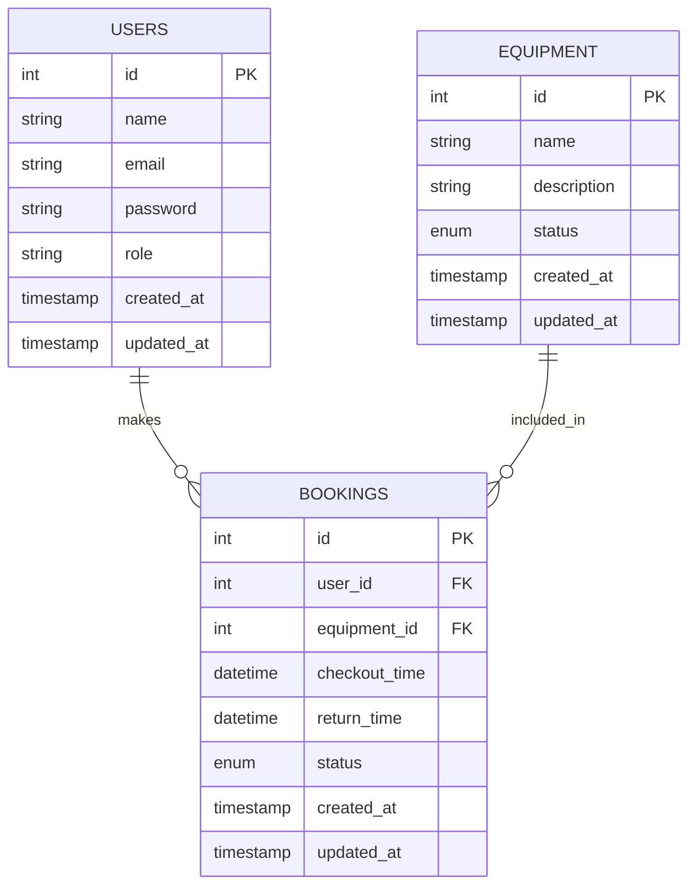

# SmartHub Management System

## ERD (Entity Relationship Diagram)



## API Documentation

### Endpoints (Requires Bearer Token)

**1. GET `/api/equipment`**
*   Returns a list of all equipment.

**2. POST `/api/equipment/{id}/checkout`**
*   Checks out an equipment for the authenticated user.
*   Returns:
```json
{
    "message": "Equipment checked out successfully",
    "booking": { ... },
    "equipment": { ... }
}
```

**3. POST `/api/equipment/{id}/checkin`**
*   Returns equipment back.
*   Returns:
```json
{
    "message": "Equipment checked in successfully",
    "equipment": { ... }
}
```

## Setup Instructions
1. Run `composer install`
2. Configure `.env` database to point to MySQL database `smarthub`.
3. Run `php artisan migrate`
4. Run `npm install && npm run build`
5. Run `php artisan serve`

## Testing
To run tests:
`php artisan test`
